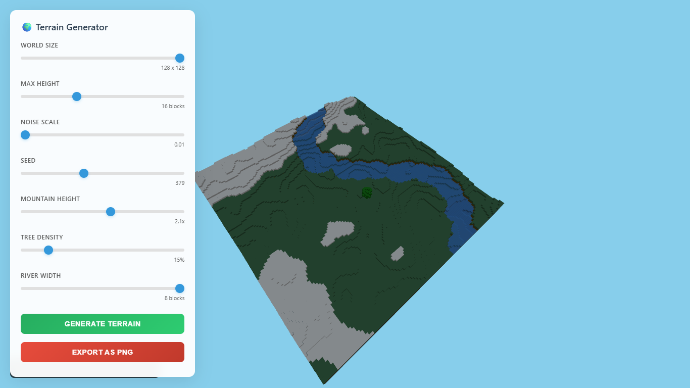

# 🌍 Voxel Terrain Generator

A real-time 3D voxel terrain generator built with Three.js that creates procedural landscapes with mountains, rivers, trees, and various biomes.



## ✨ Features

- **Procedural Generation**: Create infinite unique terrains using Perlin noise
- **Real-time Preview**: Instant terrain generation and visualization
- **Multiple Biomes**: Grass, dirt, stone, snow-capped mountains, and water
- **Dynamic Rivers**: Procedurally generated winding rivers
- **Tree Generation**: Realistic tree placement with configurable density
- **Interactive Controls**: Comprehensive parameter adjustment
- **High-Quality Export**: Export terrains as high-resolution PNG images
- **Optimized Rendering**: Uses instanced meshes for excellent performance

## 🚀 Quick Start

### Prerequisites

- Modern web browser with WebGL support
- Local web server (for ES6 modules)

### Installation

1. Clone or download the project files
2. Start a local web server in the project directory:
   ```bash
   # Using Python 3
   python -m http.server 8000
   
   # Using Node.js http-server
   npx http-server
   
   # Using Live Server (VS Code extension)
   # Right-click index.html → "Open with Live Server"
   ```
3. Open `http://localhost:8000` in your browser

### Project Structure

```
voxel-terrain-generator/
├── index.html              # Main HTML file
├── main.js                 # Application entry point
├── src/
│   ├── terrain/
│   │   ├── TerrainGenerator.js    # Core terrain generation logic
│   │   ├── MaterialManager.js     # Material definitions and management
│   │   └── NoiseGenerator.js      # Perlin noise implementation
│   ├── scene/
│   │   └── SceneManager.js        # Three.js scene setup and management
│   └── utils/
│       └── ExportManager.js       # PNG export functionality
└── README.md
```

## 🎮 Controls

### Interface Controls

- **World Size**: Adjust terrain dimensions (32x32 to 128x128)
- **Max Height**: Set maximum terrain elevation (8-32 blocks)
- **Noise Scale**: Control terrain detail and roughness (0.01-0.1)
- **Seed**: Change the random seed for different terrain patterns
- **Mountain Height**: Adjust mountain prominence (1.0x-3.0x)
- **Tree Density**: Control forest coverage (0-100%)
- **River Width**: Set river thickness (1-8 blocks)

### Camera Controls

- **Mouse Drag**: Orbit around the terrain
- **Mouse Wheel**: Zoom in/out
- **Right Click + Drag**: Pan the view

### Actions

- **Generate Terrain**: Create new terrain with current settings
- **Export as PNG**: Save high-resolution image (1920x1080)

## 🛠️ Technical Details

### Terrain Generation Algorithm

The terrain uses multi-octave Perlin noise for realistic height generation:

1. **Base Terrain**: Primary noise layer for general landscape
2. **Mountain Layer**: Secondary noise for dramatic elevation changes
3. **River Carving**: Procedural river paths that modify terrain height
4. **Biome Assignment**: Height-based material selection
5. **Vegetation**: Noise-based tree placement with natural distribution

### Material System

The terrain uses different materials based on height and context:

- **Snow**: High mountain peaks (>80% max height)
- **Stone**: Mountain surfaces and rocky areas
- **Grass**: Mid-elevation surfaces suitable for vegetation
- **Dirt**: Subsurface layers beneath grass
- **Deep Stone**: Deep underground foundation
- **Water**: River and water body rendering
- **Wood/Leaves**: Tree trunk and foliage materials

### Performance Optimizations

- **Instanced Rendering**: Groups identical blocks for efficient GPU rendering
- **Material Batching**: Minimizes draw calls by grouping same materials
- **LOD System**: Optimized geometry for different viewing distances
- **Shadow Mapping**: Efficient shadow rendering with PCF soft shadows

## 🎨 Customization

### Adding New Materials

```javascript
// In MaterialManager.js
createMaterials() {
    return {
        // ... existing materials
        newMaterial: new THREE.MeshLambertMaterial({ 
            color: 0xYOURCOLOR,
            transparent: false
        })
    };
}
```

### Modifying Terrain Generation

```javascript
// In TerrainGenerator.js
generateHeightMap(noise, size, maxHeight, noiseScale, mountainHeight) {
    // Customize noise parameters
    let baseNoise = noise.octaveNoise(
        x * noiseScale,
        z * noiseScale,
        0,
        4,        // octaves
        0.5,      // persistence
        2.0       // lacunarity
    );
    
    // Add your custom terrain shaping here
    // ...
}
```

### Creating Custom Biomes

```javascript
// In MaterialManager.js
getMaterialForHeight(height, maxHeight, surfaceHeight, blockType) {
    // Define custom height-based material rules
    if (height > customThreshold) {
        return this.materials.customBiome;
    }
    // ...
}
```

## 📦 Dependencies

- **Three.js**: 3D graphics library
- **OrbitControls**: Camera control system (from Three.js examples)

## 🔧 Configuration Options

### Noise Parameters

```javascript
const terrainConfig = {
    octaves: 4,           // Detail layers
    persistence: 0.5,     // Amplitude reduction per octave
    lacunarity: 2.0,      // Frequency increase per octave
    scale: 0.05,          // Overall noise scale
    mountainHeight: 2.0   // Mountain prominence multiplier
};
```

### Rendering Settings

```javascript
const renderConfig = {
    antialias: true,
    shadowMapSize: 2048,
    maxDistance: 200,
    fogDensity: 0.01
};
```

## 🎯 Use Cases

- **Game Development**: Procedural world generation for games
- **Visualization**: Terrain modeling and landscape design
- **Education**: Learning procedural generation techniques
- **Art**: Creating digital landscapes and environments
- **Prototyping**: Quick terrain concepts for larger projects

## 🐛 Troubleshooting

### Common Issues

**Blank/Black Screen**
- Ensure you're running from a web server (not file://)
- Check browser console for WebGL support errors
- Verify all file paths are correct

**Poor Performance**
- Reduce world size for older hardware
- Lower tree density for better frame rates
- Disable shadows in SceneManager if needed

**Export Not Working**
- Check if browser supports canvas.toDataURL()
- Ensure pop-up blocker isn't preventing download
- Try generating terrain before exporting

### Browser Compatibility

- **Chrome**: Full support
- **Firefox**: Full support
- **Safari**: Full support (macOS/iOS)
- **Edge**: Full support

Minimum WebGL 1.0 support required.

## 🚀 Future Enhancements

- [ ] Caves and underground structures
- [ ] Dynamic weather and seasons
- [ ] Multiple biome types (desert, tundra, jungle)
- [ ] Structure generation (villages, ruins)
- [ ] Texture support for materials
- [ ] Real-time water simulation
- [ ] Erosion simulation
- [ ] Multiplayer terrain sharing

## 📄 License

This project is open source and available under the [MIT License](LICENSE).

## 📞 Support

If you encounter any problems or have questions:

1. Check the troubleshooting section above
2. Look through existing issues
3. Create a new issue with detailed information
4. Include browser version and error messages

---

**Made with ❤️ and Three.js**

*Generate infinite worlds, one voxel at a time!*